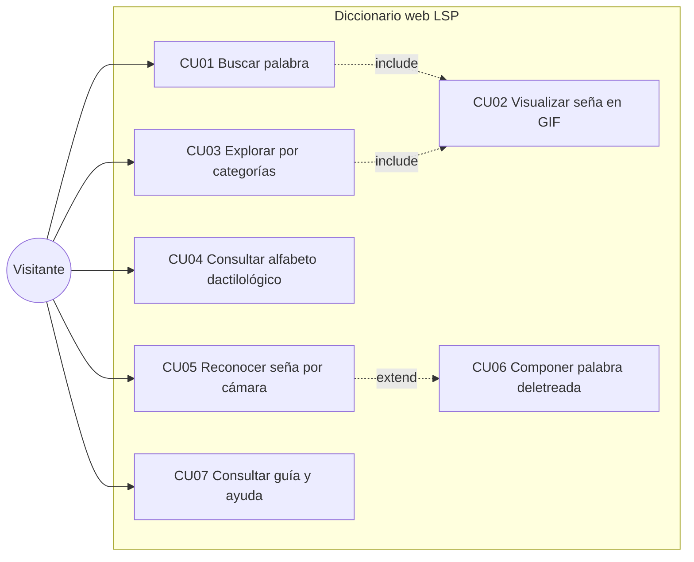
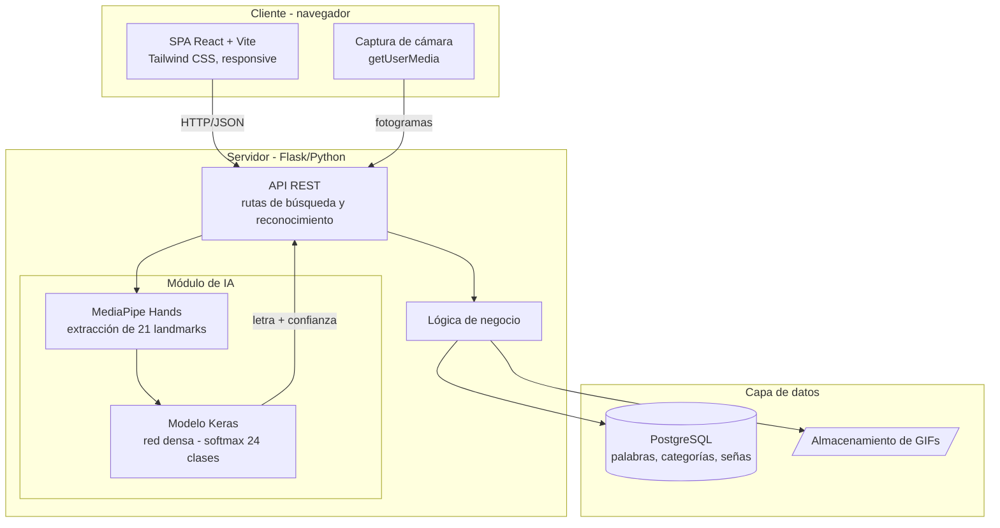
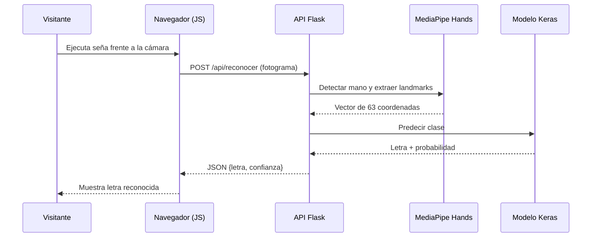
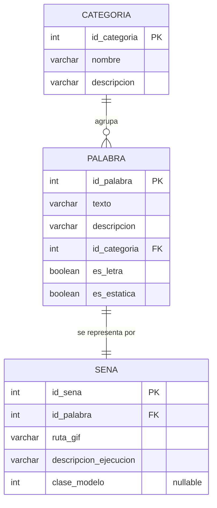
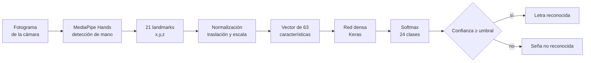

# CAPÍTULO IV: DESARROLLO DE LA SOLUCIÓN

*(Redactado como diseño completo del sistema. Las evidencias de implementación —capturas, código, métricas de sprints— se insertarán durante el desarrollo de la aplicación.)*

## 4.1. Análisis del sistema

### 4.1.1. Descripción general

El sistema es un **diccionario web público de la Lengua de Señas Peruana**, implementado como una aplicación de página única (React + Vite + Tailwind CSS) que consume una API REST en Flask, con tres funciones esenciales: buscar una palabra en español y visualizar su seña en formato GIF; explorar el alfabeto dactilológico; y reconocer, mediante la cámara del usuario, la seña estática del alfabeto que este ejecuta, mostrando la letra correspondiente. No existe registro de usuarios, autenticación ni perfiles: toda la funcionalidad es de libre acceso. La administración del contenido (alta de palabras y GIFs) se realiza internamente por los responsables mediante un módulo de importación por línea de comandos, capaz de sincronizar el contenido desde una API de señas y de importar lotes en formato JSON o CSV, sin módulos administrativos expuestos al público y sin modificar el código fuente.

### 4.1.2. Requisitos funcionales

| Código | Requisito | Prioridad |
|---|---|---|
| RF01 | El sistema permitirá buscar palabras en español mediante un campo de búsqueda con coincidencia parcial (autocompletado). | Alta |
| RF02 | El sistema mostrará, para cada palabra encontrada, su seña en formato GIF animado en bucle, junto con la palabra y su categoría. | Alta |
| RF03 | El sistema permitirá explorar las palabras por categoría temática (p. ej., alfabeto, saludos, familia, números). | Media |
| RF04 | El sistema presentará el alfabeto dactilológico completo, con el GIF de cada letra, incluidas las letras dinámicas J, Z y Ñ. | Alta |
| RF05 | El sistema permitirá activar la cámara web del usuario, previa autorización del navegador, para el reconocimiento de señas. | Alta |
| RF06 | El sistema reconocerá en tiempo real las señas estáticas del alfabeto dactilológico ejecutadas frente a la cámara y mostrará la letra predicha con su nivel de confianza. | Alta |
| RF07 | El sistema permitirá al usuario componer palabras deletreadas: las letras reconocidas se irán acumulando en un campo de texto editable. | Media |
| RF08 | El sistema mostrará una guía breve de uso del módulo de reconocimiento (posición de la mano, distancia, iluminación). | Media |
| RF09 | El sistema mostrará una sección informativa sobre la LSP y sobre el proyecto. | Baja |
| RF10 | El sistema registrará de forma anónima métricas de uso agregadas (búsquedas realizadas, reconocimientos ejecutados) para fines de evaluación. | Baja |
| RF11 | El sistema permitirá actualizar el vocabulario mediante herramientas internas de sincronización (desde una API de señas) e importación de lotes JSON/CSV, sin modificar el código fuente. | Media |

### 4.1.3. Requisitos no funcionales

| Código | Requisito |
|---|---|
| RNF01 | Accesibilidad: la interfaz cumplirá los criterios de nivel AA de las WCAG 2.1 aplicables (contraste, texto alternativo, navegación por teclado, lenguaje claro). |
| RNF02 | Rendimiento: el tiempo de respuesta del reconocimiento no excederá 1 segundo por predicción; la búsqueda de palabras responderá en menos de 2 segundos. |
| RNF03 | Compatibilidad: el sistema funcionará en las versiones recientes de Chrome, Firefox y Edge, en escritorio y móvil (diseño responsive). |
| RNF04 | Privacidad: el video de la cámara se procesará sin almacenarse; ninguna imagen del usuario se guardará ni transmitirá para fines distintos de la predicción. |
| RNF05 | Disponibilidad: el sistema estará desplegado en un servicio de nube con disponibilidad razonable para un servicio público no crítico. |
| RNF06 | Mantenibilidad: el vocabulario será ampliable mediante la carga de nuevos registros y GIFs sin modificar el código. |
| RNF07 | Escalabilidad: la arquitectura permitirá incorporar en el futuro el reconocimiento de señas dinámicas sin rediseño estructural. |

### 4.1.4. Historias de usuario (product backlog inicial)

| ID | Historia | Prioridad | Sprint |
|---|---|---|---|
| HU01 | Como visitante, quiero buscar una palabra en español para ver cómo se ejecuta su seña. | Alta | 1 |
| HU02 | Como visitante, quiero ver la seña como animación en bucle para comprender su movimiento. | Alta | 1 |
| HU03 | Como visitante, quiero explorar el alfabeto dactilológico completo para aprender a deletrear. | Alta | 1 |
| HU04 | Como visitante, quiero navegar por categorías para descubrir vocabulario sin conocer palabras específicas. | Media | 2 |
| HU05 | Como visitante, quiero activar mi cámara y ejecutar una seña del alfabeto para que el sistema me diga qué letra es. | Alta | 2–3 |
| HU06 | Como visitante, quiero ver el nivel de confianza de la predicción para saber si ejecuté bien la seña. | Media | 3 |
| HU07 | Como visitante, quiero componer palabras con las letras que deletreo frente a la cámara. | Media | 3 |
| HU08 | Como visitante, quiero una guía visual de uso del reconocimiento para obtener buenos resultados. | Media | 3 |
| HU09 | Como visitante sordo, quiero una interfaz predominantemente visual y de lenguaje simple para usar el sistema con autonomía. | Alta | 1–3 |
| HU10 | Como responsable del contenido, quiero cargar nuevas palabras y GIFs mediante comandos de sincronización e importación (API, JSON o CSV) para ampliar el vocabulario sin tocar el código. | Media | 2 |

## 4.2. Casos de uso

El sistema tiene un único actor externo, el **Visitante** (persona sorda u oyente; el sistema no los distingue). El responsable de contenido opera fuera de la aplicación web, mediante scripts internos.



### Especificación del caso de uso principal: CU05 — Reconocer seña por cámara

| Elemento | Descripción |
|---|---|
| Actor | Visitante |
| Precondición | El dispositivo cuenta con cámara; el usuario autoriza su uso en el navegador. |
| Flujo principal | 1. El visitante accede a la sección "Reconocer seña". 2. El sistema solicita permiso de cámara y muestra el video en vivo. 3. El visitante ejecuta una seña estática del alfabeto frente a la cámara. 4. El sistema detecta la mano, extrae los 21 puntos clave y los envía al modelo. 5. El modelo predice la letra; el sistema muestra la letra y su nivel de confianza en pantalla. 6. El proceso se repite de forma continua mientras la sección esté activa. |
| Flujos alternos | 3a. No se detecta ninguna mano: el sistema muestra la indicación "acerque su mano a la cámara". 5a. La confianza es inferior al umbral: el sistema muestra "seña no reconocida" y sugiere revisar la guía. |
| Postcondición | La letra reconocida se muestra y, si el modo composición está activo, se agrega a la palabra en construcción (CU06). |
| Requisitos asociados | RF05, RF06, RF07, RNF02, RNF04. |

*(Las especificaciones de CU01–CU04, CU06 y CU07 siguen el mismo formato y se incluirán en el anexo de casos de uso.)*

## 4.3. Arquitectura del sistema

La arquitectura es cliente-servidor de tres capas, con el componente de inteligencia artificial integrado al backend:



**Decisiones de arquitectura.** (1) La extracción de landmarks y la inferencia se ejecutan en el servidor, lo que garantiza un comportamiento uniforme entre dispositivos y mantiene el modelo centralizado; el cliente envía fotogramas a intervalos regulares. Como optimización futura puede evaluarse la inferencia en el cliente (MediaPipe/TensorFlow.js) para reducir latencia y carga del servidor. (2) Los GIFs se sirven como archivos estáticos y la base de datos almacena sus rutas, no los binarios, para un acceso eficiente. (3) La API es REST con respuestas JSON, lo que desacopla el frontend y facilita futuras aplicaciones móviles.

### Diagrama de secuencia — reconocimiento de una seña



## 4.4. Diseño de la base de datos

### 4.4.1. Modelo entidad-relación

Tres entidades bastan para el alcance definido — nótese la ausencia deliberada de cualquier entidad de usuarios o sesiones:



El atributo `es_letra` distingue las entradas del alfabeto; `es_estatica` indica si la seña es reconocible por el modelo (falso para las letras dinámicas J, Z y Ñ: 27 − 3 = 24 clases estáticas); `clase_modelo` vincula la letra con el índice de clase del clasificador, permitiendo que el resultado de una predicción enlace directamente con la entrada del diccionario.

### 4.4.2. Modelo físico (PostgreSQL)

```sql
CREATE TABLE categoria (
    id_categoria  SERIAL PRIMARY KEY,
    nombre        VARCHAR(80)  NOT NULL UNIQUE,
    descripcion   VARCHAR(255)
);

CREATE TABLE palabra (
    id_palabra    SERIAL PRIMARY KEY,
    texto         VARCHAR(120) NOT NULL,
    descripcion   VARCHAR(255),
    id_categoria  INTEGER NOT NULL REFERENCES categoria(id_categoria),
    es_letra      BOOLEAN NOT NULL DEFAULT FALSE,
    es_estatica   BOOLEAN NOT NULL DEFAULT TRUE,
    UNIQUE (texto, id_categoria)
);
CREATE INDEX idx_palabra_texto ON palabra (LOWER(texto) varchar_pattern_ops);

CREATE TABLE sena (
    id_sena                SERIAL PRIMARY KEY,
    id_palabra             INTEGER NOT NULL UNIQUE REFERENCES palabra(id_palabra),
    ruta_gif               VARCHAR(255) NOT NULL,
    descripcion_ejecucion  VARCHAR(500),
    clase_modelo           SMALLINT
);
```

El índice sobre `LOWER(texto)` con `varchar_pattern_ops` soporta el autocompletado por prefijo (RF01) con buen rendimiento.

## 4.5. Diseño del componente de inteligencia artificial

### 4.5.1. Pipeline de reconocimiento



**Normalización.** Las coordenadas se trasladan tomando la muñeca (landmark 0) como origen y se escalan por la distancia máxima entre puntos, de modo que la representación sea invariante a la posición de la mano en el encuadre y a su distancia a la cámara. Esta etapa es determinante para la generalización del modelo.

### 4.5.2. Construcción del dataset

Las muestras se capturan con un script propio que ejecuta MediaPipe Hands sobre el video de los participantes y almacena directamente los vectores de landmarks etiquetados con la letra correspondiente —nunca las imágenes, en línea con las consideraciones éticas del Capítulo III. Por cada una de las 24 clases se recolectan al menos 300 muestras de varias personas, variando ángulo, distancia, mano dominante e iluminación. El conjunto se particiona 70/15/15 (entrenamiento/validación/prueba). Como aumento de datos se aplican perturbaciones leves de ruido gaussiano y rotaciones pequeñas sobre los landmarks.

### 4.5.3. Arquitectura del modelo

| Capa | Configuración | Justificación |
|---|---|---|
| Entrada | 63 neuronas (21 × 3) | Vector de landmarks normalizado |
| Densa 1 | 128 neuronas, ReLU | Capacidad de representación |
| Dropout | 0.3 | Regularización contra sobreajuste |
| Densa 2 | 64 neuronas, ReLU | Compresión jerárquica |
| Dropout | 0.2 | Regularización |
| Salida | 24 neuronas, softmax | Distribución de probabilidad sobre las letras |

Entrenamiento con optimizador Adam (lr = 0.001), pérdida de entropía cruzada categórica, lotes de 32, hasta 100 épocas con parada temprana según la pérdida de validación. Estos hiperparámetros son el punto de partida; sus valores definitivos se determinarán experimentalmente y se reportarán en el Capítulo V. El umbral de confianza para aceptar una predicción se fija inicialmente en 0.8.

## 4.6. Diseño de interfaces

Principios rectores: interfaz predominantemente visual, textos breves y llanos, contraste AA, y las tres funciones principales accesibles desde la pantalla de inicio a un clic. Wireframes de las cuatro pantallas principales:

```
┌────────────────────────────────────────────┐   ┌────────────────────────────────────────────┐
│  LOGO   Diccionario LSP        [Acerca de] │   │  ← Volver     Resultado: "CASA"            │
│                                            │   │  ┌──────────────────────┐                  │
│      ¿Qué palabra quieres aprender?        │   │  │                      │  Categoría:      │
│   ┌─────────────────────────────┐          │   │  │     GIF DE LA        │  Hogar           │
│   │ 🔍 Escribe una palabra...   │          │   │  │     SEÑA (bucle)     │                  │
│   └─────────────────────────────┘          │   │  │                      │  Descripción de  │
│                                            │   │  └──────────────────────┘  la ejecución    │
│   [ Abecedario ]  [ Categorías ]           │   │                                            │
│   [ 📷 Reconocer seña con tu cámara ]      │   │  Palabras relacionadas: [casa][familia]... │
└────────────────────────────────────────────┘   └────────────────────────────────────────────┘
        Pantalla 1: Inicio / búsqueda                 Pantalla 2: Detalle de la seña

┌────────────────────────────────────────────┐   ┌────────────────────────────────────────────┐
│  ← Volver     Abecedario dactilológico     │   │  ← Volver     Reconocer seña      [Guía ?] │
│                                            │   │  ┌──────────────────────┐  Letra:          │
│  [A] [B] [C] [D] [E] [F] [G]               │   │  │                      │  ┌─────┐         │
│  [H] [I] [J*] [K] [L] [M] [N]              │   │  │   VIDEO EN VIVO      │  │  A  │  92 %   │
│  [Ñ*] [O] [P] [Q] [R] [S] [T]              │   │  │   (tu cámara)        │  └─────┘         │
│  [U] [V] [W] [X] [Y] [Z*]                  │   │  │                      │  Palabra:        │
│                                            │   │  └──────────────────────┘  [ A N A _ ]     │
│  * señas con movimiento (solo consulta)    │   │  [Iniciar] [Borrar] [Espacio]              │
└────────────────────────────────────────────┘   └────────────────────────────────────────────┘
        Pantalla 3: Abecedario                        Pantalla 4: Reconocimiento por cámara
```

*(Los mockups de alta fidelidad —colores, tipografía, estados— se elaborarán en la fase de diseño visual y se incluirán como figuras; puedo generarlos como imágenes cuando iniciemos el desarrollo.)*

## 4.7. Plan de desarrollo por sprints

| Sprint | Duración | Objetivo | Entregables |
|---|---|---|---|
| 0 | 1 sem. | Preparación | Repositorio, entornos, esqueleto Flask + app React (Vite + Tailwind), BD creada, CI básica |
| 1 | 2 sem. | Diccionario básico | Búsqueda con autocompletado, detalle con GIF, abecedario (HU01–HU03, HU09) |
| 2 | 2 sem. | Contenido y categorías | Navegación por categorías, módulo de importación/sincronización de contenido (API/JSON/CSV), sección informativa (HU04, HU10) |
| 3 | 2 sem. | Reconocimiento | Módulo de cámara, endpoint de predicción, integración del modelo, composición de palabras y guía (HU05–HU08) |
| 4 | 1 sem. | Endurecimiento | Accesibilidad AA, responsive, rendimiento, corrección de defectos, despliegue |

## 4.8. Plan de pruebas

**Pruebas unitarias:** funciones de normalización de landmarks, consultas de búsqueda, serialización de la API (pytest; objetivo de cobertura ≥ 70 % del backend).
**Pruebas de integración:** flujo completo búsqueda→detalle y fotograma→predicción→respuesta, con la base de datos real en entorno de pruebas.
**Pruebas funcionales:** verificación de cada requisito RF01–RF10 mediante casos de prueba trazados (tabla de trazabilidad en anexo).
**Pruebas de rendimiento:** medición de la latencia de predicción bajo carga ligera (RNF02).
**Pruebas de accesibilidad:** validación automática (Lighthouse/axe) y revisión manual de los criterios WCAG 2.1 AA aplicables (RNF01).
**Pruebas de usabilidad:** protocolo del Capítulo III — sesión guiada con 5 tareas, cuestionario SUS y encuesta de satisfacción, aplicado a la muestra de 15 usuarios.

---

### Nota de trabajo (no forma parte de la tesis)

Todo este capítulo es nuevo. Decisiones tomadas que condicionan la app que construiremos: inferencia en servidor (con TF.js como optimización futura), BD de 3 tablas sin usuarios, esquema SQL listo para ejecutar, arquitectura del modelo definida (63→128→64→24), umbral de confianza 0.8, sprints concretos. Los diagramas están en Mermaid: al ensamblar el .docx los convierto en imágenes. Falta decidir el vocabulario inicial más allá del alfabeto (sugerencia: 50–100 palabras de categorías básicas del manual CONADIS).
